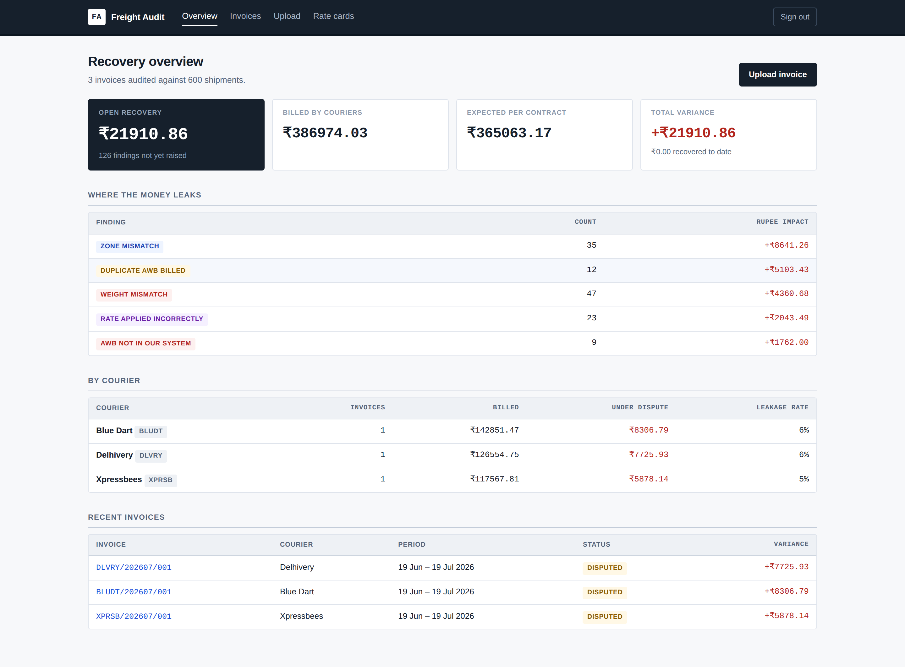
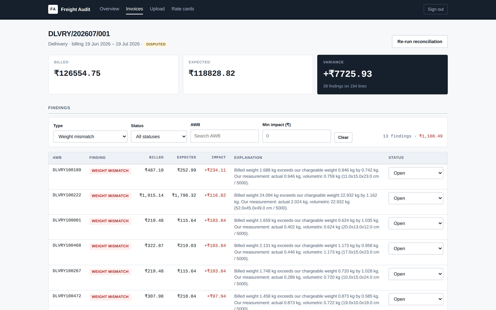

# Freight Audit — courier invoice reconciliation

A Django application that audits courier invoices against a contracted rate card
and produces a defensible list of billing disputes.

Couriers in Indian D2C logistics routinely overbill: a parcel gets weighed on
their scale rather than yours, a metro delivery is billed as a special zone, the
same AWB appears twice on one invoice. On a few thousand shipments a month the
leakage runs into lakhs, and finding it by hand in a spreadsheet is a full day's
work that nobody has time to do properly.

This tool imports the courier's invoice, recomputes what every line *should*
have cost under the signed contract, and explains each variance in language you
can paste into a dispute email.



*Portfolio view: open recovery exposure, leakage by finding type, and leakage rate per courier.*



*Every finding carries its arithmetic, so the explanation can be pasted straight into a dispute email.*

---

## What it does

- **Rate card modelling** — versioned contracts, per-zone weight slabs, fuel
  surcharge, COD fees and RTO multipliers.
- **Chargeable weight** — takes the greater of dead weight and volumetric
  weight (L×W×H ÷ divisor), which is how couriers actually price.
- **Reconciliation engine** — recomputes expected freight per line and
  classifies every variance:

  | Finding | Meaning |
  |---|---|
  | `WEIGHT` | Billed weight exceeds our measured chargeable weight |
  | `ZONE` | Billed as a farther (pricier) zone than the destination |
  | `RATE` | Weight and zone agree, arithmetic does not |
  | `DUPLICATE` | Same AWB billed more than once on one invoice |
  | `UNKNOWN_AWB` | Billed for a parcel that is not in our records |
  | `NO_RATE_CARD` | No contract covers this billing period |

- **CSV ingestion** — tolerant of the mess real courier exports arrive in:
  BOM-prefixed headers, `₹`/`Rs`/comma-separated amounts, varying header names,
  blank trailing rows. Bad rows are reported individually rather than failing
  the whole file.
- **Dashboard** — open recovery exposure, leakage by finding type, leakage rate
  per courier.
- **Dispute workflow** — each finding moves Open → Disputed → Recovered/Waived,
  updated inline without a page reload.

---

## Stack

Python 3.12 · Django 5.1 · PostgreSQL · HTML/CSS · JavaScript (jQuery 3.7)

No frontend framework. The interface is server-rendered Django templates, with
jQuery handling the two places that genuinely benefit from being asynchronous:
filtering the findings table and updating a dispute status.

---

## Running it

```bash
git clone https://github.com/dev-tushaar/courier_recon_analysis.git
cd courier_recon_analysis/courier_recon

python -m venv .venv && source .venv/bin/activate   # Windows: .venv\Scripts\activate
pip install -r requirements.txt

cp .env.example .env
```

Create the database and put its URL in `.env`:

```bash
createdb courier_recon
# .env -> DATABASE_URL=postgres://<user>:<password>@localhost:5432/courier_recon
```

Generate a secret key for `.env`:

```bash
python -c "from django.core.management.utils import get_random_secret_key; print(get_random_secret_key())"
```

Then:

```bash
python manage.py migrate
python manage.py seed_demo --shipments 600   # demo data with planted billing errors
python manage.py createsuperuser
python manage.py runserver
```

Open http://127.0.0.1:8000/. Rate cards are maintained through the Django admin
at `/admin/`.

### Tests

```bash
python manage.py test reconciliation
```

54 tests: pricing arithmetic, each discrepancy type, CSV edge cases, view
permissions, and the JSON endpoints.

---

## How it is put together

```
config/                     settings, root URLs
reconciliation/
├── models.py               reference data, operational data, billing data
├── services/
│   ├── rating.py           freight calculation (pure functions, no ORM)
│   ├── reconciler.py       compares billed vs expected, emits findings
│   └── ingest.py           CSV parsing and normalisation
├── views.py                pages + two JSON endpoints
├── forms.py                upload form with cross-field validation
├── admin.py                rate card maintenance
├── templates/
├── static/                 app.css, app.js, vendored jQuery
├── management/commands/
│   └── seed_demo.py        generates data with deliberate billing errors
└── tests/
```

### Decisions worth explaining

**Business logic lives in `services/`, not in models or views.** `rating.py`
takes plain values and returns a result object — it never touches the database.
That means the pricing rules can be unit tested without fixtures (the whole
rating test file runs in milliseconds), and the same function is reusable for
rate-shopping later.

**`Decimal` everywhere money appears, never `float`.** `0.1 + 0.2 != 0.3` in
binary floating point, and reconciliation is exactly where sub-paisa drift
compounds into a wrong dispute total. Rounding is explicitly `ROUND_HALF_UP`,
because Python's default banker's rounding turns ₹0.125 into ₹0.12 while every
courier invoice rounds it to ₹0.13.

**Slab counting uses integer division on Decimals.** Couriers charge per
*started* weight slab, so a parcel sitting exactly on a 1.5 kg boundary must
cost two slabs, not three. Converting to float to call `math.ceil` reintroduces
the representation error that causes precisely this off-by-one. There are
dedicated tests for the boundary cases.

**The reconciler resolves everything in bulk before the loop.** Shipments, the
rate card and its slabs are fetched once into dictionaries; line updates and
findings are written with `bulk_update` / `bulk_create`. The query count is
constant rather than proportional to invoice size — the difference between ~9
queries and ~60,000 on a 20,000-line invoice. A test asserts that a 20-line
invoice costs the same number of queries as a 5-line one, so the N+1 cannot be
reintroduced silently.

**A materiality threshold of ₹1.** Without it, half-paisa surcharge rounding
raises thousands of meaningless findings and the real ones become invisible.
Likewise a 50 g weight tolerance, because courier scales legitimately differ
from ours and that is not a dispute.

**Findings are not double-counted.** If a line has both a weight error and a
price variance, the rupee impact is attributed to the weight error as root
cause rather than raising a second `RATE` finding for the same money.

**Unmatched AWBs are stored, not rejected.** A courier billing for a parcel we
never shipped is the finding, so refusing to import the row would hide the
problem. `InvoiceLine.shipment` is nullable for this reason.

**Reconciliation is idempotent and transactional.** Re-running clears prior
findings first, and the whole run is wrapped in `transaction.atomic` — a
half-reconciled invoice is worse than an unreconciled one, because it looks
finished.

**Uniqueness is enforced in the database.** `(courier, invoice_number)` is a
`UniqueConstraint`, not a view-level check, so a double-submit cannot slip a
duplicate invoice through the race window.

**jQuery is vendored, not loaded from a CDN.** An internal finance tool should
not break because a third party is down.

---

## Sample data

`sample_data/sample_invoice.csv` shows the expected upload format. Header names
are matched loosely — `awb`, `awb_no`, `waybill` and `tracking_id` all resolve
to the AWB column.

```csv
awb,zone,weight_kg,amount
DLVRY100000,C,0.946,138.42
```

`seed_demo` plants a known number of deliberate errors and prints how many the
engine detected, so the reconciler can be sanity-checked against ground truth.

---

## Known limitations

- Zone is stored on the shipment rather than derived from a pincode-to-zone
  table, so a wrong zone at dispatch propagates into the audit.
- No background job runner. Large invoices reconcile synchronously in the
  request; past roughly 50,000 lines this belongs in Celery.
- Dispute emails are not generated or sent — the explanation text is written to
  be pasted, but the sending is manual.
- Single-currency (INR) and single-tenant.
